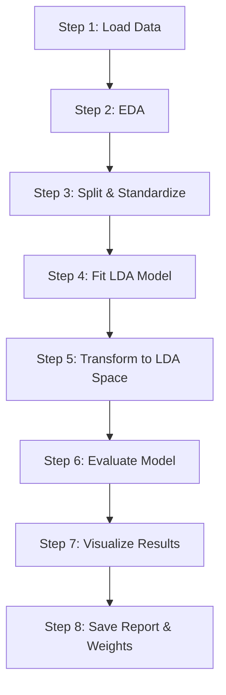

# Machine Learning Pipeline Guide

This document provides a detailed walkthrough of the **8-Stage Linear Discriminant Analysis (LDA) Machine Learning Pipeline** implemented in this project. 

The pipeline orchestrates data loading, exploratory analysis, preprocessing, training, prediction, evaluation, visualization, and model serialization—all implemented in **pure Python** without external ML libraries (like `scikit-learn`, `numpy`, `pandas`, or `scipy`).

---

## Pipeline Overview

The pipeline is coordinated by [main.py](../main.py). It operates on the **UCI Wine Dataset** (178 samples, 13 chemical features, 3 wine classes) to train a classification model.



---

## Detailed Pipeline Stages

### Step 1: Data Loading & Embedded Fallback
* **Module:** [src/preprocessing/data_loader.py](../src/preprocessing/data_loader.py)
* **Function:** [load_wine](../src/preprocessing/data_loader.py#L257)
* **Operation:**
  1. Checks if a CSV data file exists at the configured path (primary source: `data/processed/wine.csv`).
  2. If found, parses the CSV using Python's native `csv` module, skipping the header.
  3. If missing, it automatically falls back to an embedded raw dataset string (`_fetch_wine_builtin()`) containing all 178 samples.
* **Why this design?** This fallback system ensures that the code runs immediately out-of-the-box on any system (e.g., in a CI/CD environment or a fresh checkout) without requiring manual data preparation.

### Step 2: Exploratory Data Analysis (EDA)
* **Module:** [src/preprocessing/data_loader.py](../src/preprocessing/data_loader.py)
* **Function:** [describe](../src/preprocessing/data_loader.py#L535)
* **Operation:** 
  - Computes global dataset descriptors (sample count, class counts).
  - Summarizes the distribution of classes.
  - Computes basic statistics (minimum, maximum, mean) for each of the 13 features.
* **Console Output:** Outputs a clean ASCII table representing feature statistics directly to the terminal.

### Step 3: Train/Test Split & Standardization
* **Module:** [src/preprocessing/data_loader.py](../src/preprocessing/data_loader.py)
* **Functions:** [train_test_split](../src/preprocessing/data_loader.py#L374) and [standardize](../src/preprocessing/data_loader.py#L453)
* **Operation:**
  1. **Seeded Shuffling:** Generates a deterministic permutation of indices using a **Linear Congruential Generator (LCG)**. This avoids dependency on `random` or `numpy.random` and guarantees identical train/test splits across runs given the same seed.
  2. **Split:** Splits the data into **75% training** (133 samples) and **25% testing** (45 samples) partitions.
  3. **Standardization (Z-score normalization):** 
     - Computes the mean ($\mu$) and standard deviation ($\sigma$) of each feature *using the training set only*.
     - Transforms features: $x_{std} = \frac{x - \mu}{\sigma}$.
     - Applies the training statistics ($\mu, \sigma$) to normalize the test set.
* **Prevention of Data Leakage:** Fitting the scaler on the training set and applying it to the test set ensures that no information from the test partition leaks into the model training phase.

### Step 4: Model Fitting (LDA)
* **Module:** [src/lda/lda_model.py](../src/lda/lda_model.py)
* **Function:** [LDA.fit](../src/lda/lda_model.py#L100)
* **Operation:**
  - Computes within-class scatter matrix ($S_W$) and between-class scatter matrix ($S_B$).
  - Solves the generalized eigenvalue problem $S_W^{-1} S_B w = \lambda w$ by computing the inverse of $S_W$ (with diagonal regularization if singular) and performing symmetric eigendecomposition on $M_{sym} = 0.5 (M + M^T)$.
  - Extracts the top $C-1$ (where $C = 3$, so 2 components) eigenvalues and eigenvectors using a custom power iteration method with Hotelling deflation.
  - Learns the projection matrix $W$ (`scalings_`) and stores class means in the original space.

### Step 5: Dimensionality Reduction (Transformation)
* **Module:** [src/lda/lda_model.py](../src/lda/lda_model.py)
* **Function:** [LDA.transform](../src/lda/lda_model.py#L216)
* **Operation:**
  - Projects the 13-dimensional standardized dataset down to a 2-dimensional space:
    $$X_{lda} = X \times W$$
  - This step collapses the features along the most discriminative axes, maximizing class separation.

### Step 6: Classification & Prediction
* **Module:** [src/lda/lda_model.py](../src/lda/lda_model.py)
* **Function:** [LDA.predict](../src/lda/lda_model.py#L278)
* **Operation:**
  - Applies a **Nearest Centroid Classifier** directly in the 2D projected LDA space.
  - Projects the learned class centroids into the LDA space.
  - Projects new query samples into the LDA space.
  - Computes the squared Euclidean distance between each sample and all class centroids.
  - Assigns the sample to the class of the closest centroid.

### Step 7: SVG Visualization Generation
* **Module:** [src/visualization/plots.py](../src/visualization/plots.py)
* **Functions:** [scatter_lda](../src/visualization/plots.py#L82), [bar_variance](../src/visualization/plots.py#L224), [heatmap_confusion](../src/visualization/plots.py#L352)
* **Operation:**
  - Instead of using `matplotlib` or `seaborn`, the code builds vector graphs (SVG format) by compiling raw SVG XML string templates.
  - Coordinates are mapped to pixels using custom scaling equations.
  - Generates 4 highly detailed plots using a professional dark theme:
    1. **lda_train.svg:** 2D scatter plot of training samples showing class clusters.
    2. **lda_test.svg:** 2D scatter plot showing how test samples project relative to the clusters.
    3. **explained_variance.svg:** Bar chart of variance ratios indicating the significance of LD1 and LD2.
    4. **confusion_matrix.svg:** Colored heatmap representing model prediction errors.

### Step 8: Reports and Model Serialization
* **Module:** [main.py](../main.py)
* **Operation:**
  1. Writes a human-readable text report containing test metrics (Accuracy, Precision, Recall, F1-score) and the model summary (eigenvalues, variance ratios) to `outputs/reports/results.txt`.
  2. Saves model weights (transformation matrix $W$ and class means in feature space) to `outputs/models/lda_weights.txt`. These weights allow making future predictions without retraining.

---

## Pipeline Configuration

All hyperparameters are centralized at the top of [main.py](../main.py):

| Parameter | Type | Default | Description |
| :--- | :--- | :--- | :--- |
| `DATA_PATH` | String | `"data/processed/wine.csv"` | Filepath for input data. Automatically falls back to built-in data if missing. |
| `TEST_SIZE` | Float | `0.25` | Proportion of data reserved for testing (0.25 = 75% train / 25% test). |
| `RANDOM_SEED`| Integer| `42` | Seed for reproducibility of train/test splits. |
| `N_COMPONENTS`| Integer| `2` | Number of dimensions to project down to (max is $C - 1 = 2$ for $C = 3$). |
| `OUTPUT_DIR` | String | `"outputs"` | Root directory for saving results, model files, and plots. |

---

## Output Artifacts

Running the pipeline populates the `outputs/` directory structure:

```
outputs/
├── figures/
│   ├── lda_train.svg            # Training scatter plot
│   ├── lda_test.svg             # Test scatter plot
│   ├── explained_variance.svg   # Explained variance bar chart
│   └── confusion_matrix.svg     # Heatmap confusion matrix
├── reports/
│   └── results.txt              # Performance evaluation summary
└── models/
    └── lda_weights.txt          # Saved transformation matrix & class means
```

### Serialized Model Format (`lda_weights.txt`)
The serialized model file is structured in plain-text format for readability and parser simplicity:
- **LDA Scalings ($W$ matrix):** Rows correspond to features (00 to 12); columns correspond to LD1 and LD2 coefficients.
- **Class Means:** Centroids of class 1, 2, and 3 in the standardized 13D feature space.
